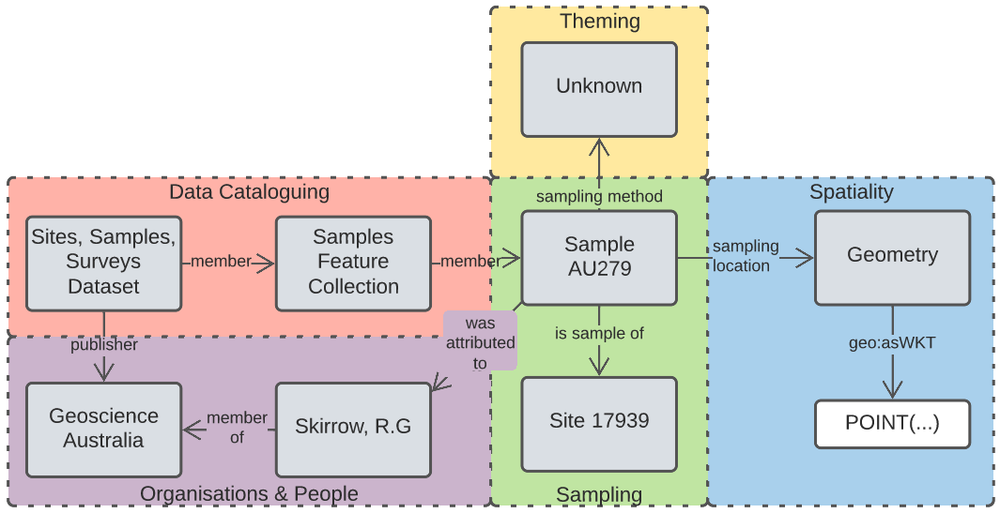

This Model - the GA Supermodel - is https://www.ga.gov.au[Geoscience Australia]'s overarching data model that provides integration logic for data elements in many of GA's specialised domains. It also provides logic for Persistent Identifier (PID) patterning. It is based on the general-purpose https://linked.data.gov.au/def/supermodel[Supermodel Model].

[id=fig-eg]
.Example of data instances, Sample AU279 & Site 17939, with <<#data-domain, Data Domains>> shown using diagram elements from the Key in <<fig-level0-key, Figure 1>>

== Metadata

[width=75%, frame=none, grid=none, cols="1,5"]
|===
|**IRI** | https://linked.data.gov.au/def/ga-supermodel
|**Title** | Geoscience Australia Supermodel Specification
|**Description** | This Model - the GA Supermodel - is https://www.ga.gov.au[Geoscience Australia]'s overarching data model that provides integration logic for data elements in many of GA's specialised domains. It also provides logic for Persistent Identifier (PID) patterning.
|**Created** | 2021-12-14
|**Modified** | 2022-05-23
|**Issued** | 0000-00-00
|**Creator** | https://linked.data.gov.au/org/ga[Geoscience Australia]
|**Publisher** | https://linked.data.gov.au/org/ga[Geoscience Australia]
|**License** | https://creativecommons.org/licenses/by/4.0/[Creative Commons Attribution 4.0 International (CC BY 4.0)]
|**Machine-readable form** | https://surroundaustralia.github.io/ga-supermodel/supermodel.ttl[supermodel.ttl]
|===

== Preamble

=== Abstract

This Model - the GA Supermodel - is https://www.ga.gov.au[Geoscience Australia]'s overarching data model that provides integration logic for data elements in many of GA's specialised domains. It also provides logic for Persistent Identifier (PID) patterning. It is based on the general-purpose https://linked.data.gov.au/def/supermodel[Supermodel Model].

=== Namespaces

This model is built on a "baseline" of Semantic Web models which use a variatey of namespaces. Prefixes for thess namespaces, used througout this document, are listed below.

[id=tbl-prefixes, width=100%, frame=none, grid=none, cols="1,4,4"]
.Namespaces
|===
|Prefix | Namespace | Description

| **`super:`** | **`https://linked.data.gov.au/def/supermodel/`** | **the Supermodel meta-model**
|`dcterms:` | `http://purl.org/dc/terms/` | Dublin Core Terms vocabulary namespace
|`ex:` | `http://example.com/` | Generic examples namespace
|`owl:` | `http://www.w3.org/2002/07/owl#` | Web Ontology Language ontology namespace
|`rdfs:` | `http://www.w3.org/2000/01/rdf-schema#` | RDF Schema ontology namespace
|`sosa:` | `http://www.w3.org/ns/sosa/` | Sensor, Observation, Sample, and Actuator ontology namespace
|`skos:` | `http://www.w3.org/2004/02/skos/core#` | Simple Knowledge Organization System (SKOS) ontology namespace
|`time:` | `http://www.w3.org/2006/time#` | Time Ontology in OWL namespace
|`void:` | `http://rdfs.org/ns/void#` | Vocabulary of Interlinked Data (VoID) ontology namespace
|`xsd:` | `http://www.w3.org/2001/XMLSchema#` | XML Schema Definitions ontology namespace
|===

=== Terms & Definitions

The following terms appear in this document and, when they do, the definitions in this section apply to them.

The following terms appear in this document and, when they do, the definitions in this section apply to them. This section's content is also presented online in a formal vocabulary at:

* `https://linked.data.gov.au/def/supermodel/terms[https://linked.data.gov.au/def/supermodel/terms]`

[frame=none, grid=none, cols="1,1,3,1"]
|===
| Term | IRI | Definition | Source

| [[central-class]] *Central Class* | https://linked.data.gov.au/def/supermodel/terms/central-class[`td:central-class`]
| Central Classes are the generic data classes at the centre of Data Domains with high-level relationships between them defined in this supermodel. 

These classes are taken from general standards - usually well-known international stadnards - and the Indigenous Data Network specialises and extends them to make specific, custom, classes for their needs. | Supermodel model

| [[component-data-model]] *Component Data Model* | https://linked.data.gov.au/def/supermodel/terms/component-data-model[`td:component-data-model`]
| A data model for a particular component of a Supermodel. The Component Data Model may have been designed for a particular Supermodel that uses t but it may also pre-exist and it just indicated for use within the Supermodel. 

A Supermodel will always need to provide mappings from classes within a Component Data Model to other Supermodel elements for interoperability | Supermodel model

| [[data-domain]] *Data Domain* | https://linked.data.gov.au/def/supermodel/terms/data-domain[`td:data-domain`]
| High-level conceptual areas within which Geosicence Australia has data. 

These Data Domains are not themed scientificly - 'geology', 'hydrogeology', etc. - but instead based on parts of the _Observations & Measurement_ <<ISO19156>> standard, realised in Semantic Web form in the SOSA Ontology, part of the _Semantic Sensor Network Ontology_ <<SSN>>.

Current Data Domain are shown in <<fig-top-level, Figure 1>>. | Supermodel model

| [[knowledge-graph]] *Knowledge Graph* | https://linked.data.gov.au/def/supermodel/terms/knowledge-graph[`td:knowledge-graph`]
| A Knowledge Graph is a dataset that uses a graph data tructure - nodes and edges - with strongly-defined elements. | Common use, e.g. https://en.wikipedia.org/wiki/Knowledge_graph

| [[linked-data]] *Linked Data* | https://linked.data.gov.au/def/supermodel/terms/linked-data[`td:linked-data`]
| A set of technologies and conventions defined by the https://www.w3.org[World Wide Web Consortium] that aim to present data in both human- and machine-readable form over the Internet. 

Linked Data is strongly-defined with each element having either a local definition or a link to an available definition on the Internet.

Linked Data is graph-based in nature, that is it consistes of nodes and edges that can forever be linked to further conceps with defined relationships.
| https://www.w3.org/standards/semanticweb/data

| [[semantic-web]] *Semantic Web* | https://linked.data.gov.au/def/supermodel/terms/semantic-web[`td:semantic-web`]
| The https://www.w3.org[World Wide Web Consortium]'s vision of an Internet-based web of Linked Data. 

Semantic Web is used to refer to something more than just the technologies and conventions of Linked Data; the term also encompases a specific set of interoperable data models - often called ontologies - published by the W3C, other standards bodies and some well-known companies.

The 'semantic' refers to the strongly-defined nature of the elements in the Semantic Web: the meaning of Semantic Web data is as precicely defined as any data can be.
| https://www.w3.org/standards/semanticweb/
|===

=== Conventions

All model diagrams use elements introduced in <<#fig-level0-key, Figure 1>>. These elements are defined in the RDF, RDFS and OWL ontologies, see <<OWL>> for mode details.

All code snippets in this document, used to show formal and machine-readable versions of concepts, are expressed using the Turtle RDF syntax <<TTL>>.