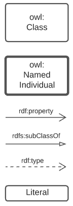
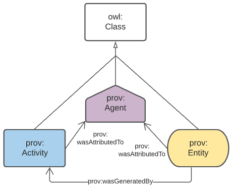
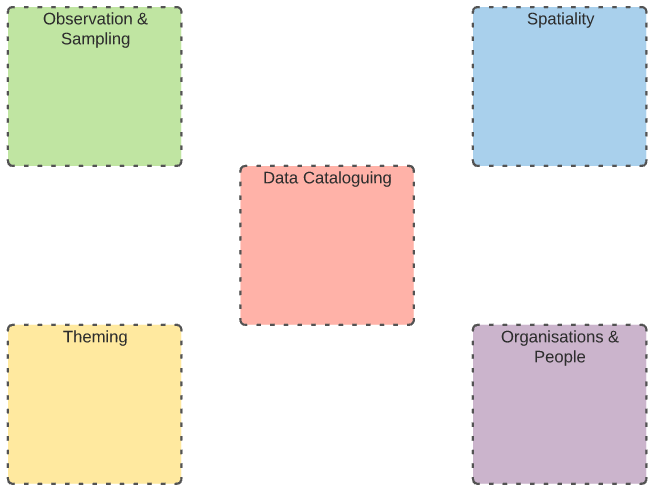

= Geoscience Australia Supermodel
:toc: left
:table-stripes: even
:sectnums:

== Metadata

[width=75%, frame=none, grid=none, cols="1,5"]
|===
|**IRI** | https://linked.data.gov.au/def/ga-supermodel
|**Title** | Geoscience Australia Supermodel Specification
|**Description** | This Model - the GA Supermodel - is https://www.ga.gov.au[Geoscience Australia]'s overarching data model that provides integration logic for data elements in many of GA's specialised domains. It also provides logic for Persistent Identifier (PID) patterning.
|**Created** | 2021-12-14
|**Modified** | 2022-03-30
|**Issued** | 0000-00-00
|**Creator** | https://linked.data.gov.au/org/ga[Geoscience Australia]
|**Publisher** | https://linked.data.gov.au/org/ga[Geoscience Australia]
|**License** | https://creativecommons.org/licenses/by/4.0/[Creative Commons Attribution 4.0 International (CC BY 4.0)]
|**Machine-readable form** | https://surroundaustralia.github.io/ga-supermodel/supermodel.ttl[supermodel.ttl]
|===

== Preamble

=== Abstract

This Model - the GA Supermodel - is https://www.ga.gov.au[Geoscience Australia]'s overarching data model that provides integration logic for data elements in many of GA's specialised domains. It also provides logic for Persistent Identifier (PID) patterning. It is based on the general-purpose https://linked.data.gov.au/def/supermodel[Supermodel Model].

=== Namespaces

This model is built on a "baseline" of Semantic Web models which use a variatey of namespaces. Prefixes for thess namespaces, used througout this document, are listed below.

[id=tbl-prefixes, width=100%, frame=none, grid=none, cols="1,4,4"]
.Namespaces
|===
|Prefix | Namespace | Description

| **`super:`** | **`https://linked.data.gov.au/def/supermodel/`** | **the Supermodel meta-model**
|`dcterms:` | `http://purl.org/dc/terms/` | Dublin Core Terms vocabulary namespace
|`ex:` | `http://example.com/` | Generic examples namespace
|`owl:` | `http://www.w3.org/2002/07/owl#` | Web Ontology Language ontology namespace
|`rdfs:` | `http://www.w3.org/2000/01/rdf-schema#` | RDF Schema ontology namespace
|`sosa:` | `http://www.w3.org/ns/sosa/` | Sensor, Observation, Sample, and Actuator ontology namespace
|`skos:` | `http://www.w3.org/2004/02/skos/core#` | Simple Knowledge Organization System (SKOS) ontology namespace
|`time:` | `http://www.w3.org/2006/time#` | Time Ontology in OWL namespace
|`void:` | `http://rdfs.org/ns/void#` | Vocabulary of Interlinked Data (VoID) ontology namespace
|`xsd:` | `http://www.w3.org/2001/XMLSchema#` | XML Schema Definitions ontology namespace
|===

=== Terms & Definitions

The following terms appear in this document and, when they do, the definitions in this section apply to them.

[id=central-class]
Central Class::

`https://linked.data.gov.au/def/supermodel-td/central-class[smtd:central-class]`
+
Central Classes are the generic data classes at the centre of Data Domains with high-level relationships between them defined in this supermodel.
+
These classes are taken from general standards - usually well-known international stadnards - and Geoscience Australia specialises and extends them to make specific, custom, classes for their needs.

[id=data-domain]
Data Domain::

`https://linked.data.gov.au/def/supermodel-td/data-domain[smtd:data-domain]`
+
High-level conceptual areas within which Geosicence Australia has data.
+
These Data Domains are not themed scientificly - 'geology', 'hydrogeology', etc. - but instead based on parts of the _Observations & Measurement_ <<ISO19156>> standard, realised in Semantic Web form in the SOSA Ontology, part of the _Semantic Sensor Network Ontology_ <<SSN>>.
+
Current Data Domain are shown in <<fig-top-level, Figure 1>>.

[id=knowledge-graph]
Knowledge Graph::

`https://linked.data.gov.au/def/supermodel-td/knowledge-graph[smtd:knowledge-graph]`
+
A Knowledge Graph is a dataset that uses a graph data tructure - nodes and edges - with strongly-defined elements.

[id=linked-data]
Linked Data::

`https://linked.data.gov.au/def/supermodel-td/linked-data[smtd:linked-data]`
+
A set of technologies and conventions defined by the https://www.w3.org[World Wide Web Consortium] that aim to present data in both human- and machine-readable form over the Internet.
+
Linked Data is strongly-defined with each element having either a local definition or a link to an available definition on the Internet.
+
Linked Data is graph-based in nature, that is it consistes of nodes and edges that can forever be linked to further conceps with defined relationships.
+
-- https://www.w3.org/standards/semanticweb/data

[id=semantic-web]
Semantic Web::

`https://linked.data.gov.au/def/supermodel-td/semantic-web[smtd:semantic-web]`
+
The https://www.w3.org[World Wide Web Consortium]'s vision of an Internet-based web of Linked Data.
+
Semantic Web is used to refer to something more than just the technologies and conventions of Linked Data; the term also encompases a specific set of interoperable data models - often called ontologies - published by the W3C, other standards bodies and some well-known companies.
+
The 'semantic' refers to the strongly-defined nature of the elements in the Semantic Web: the meaning of Semantic Web data is as precicely defined as any data can be.
+
-- https://www.w3.org/standards/semanticweb/

=== Conventions

All model diagrams use elements introduced in <<#fig-level0-key, Figure 1>>. These elements are defined in the RDF, RDFS and OWL ontologies, see <<OWL>> for mode details.

All code snippets in this document, used to show formal and machine-readable versions of concepts, are expressed using the Turtle RDF syntax <<TTL>>.

== Introduction

This model described a set of <<#data-domain, Data Domains>> with <<#central-class, Central Classes>> that are associated using <<#linked-data, Linked Data>> principles. Specialisations of the Central Classes are made to cater for particular data needs.

Altogether, these things form a <<#knowledge-graph, Knowledge Graph>> of data for Geoscience Australia that participates in the wider, international, <<#semantic-web, Semantic Web>>.

This model is predicated on an assumption that GA is a data aggregation organisation and therefore data cataloguing is its major concern. At the centre of this model then is a domain of `Data Cataloguing`, the main elements of which are taken from the _Data Catalog Vocabulary_ (<<DCAT>>). The things that GA's data are mostly about are spatial things, hence a Data Domain of `Spatiality`, for which the _GeoSPARQL_ <<GEO>> is core. The way GA generates information about spatial things is via observations and various forms of sampling, hence a Data Domain of `Sampling` and for this one the _Sensor, Observation, Sample, and Actuator_ (SOSA) ontology <<SSN>> is mainly used as it which focuseses on observations and how they produce results, what the results are about and so on. GA's data is cetegorised in various ways and for this the Data Domain of `Theming` is indicated. Within it, taxonomy representation using <<SKOS>> is paramount. Finally, all organisations relate their data and processes to thus who are responsible for them, thus the final Data Domain is indeed `Organisations and People` which is modelled using a number of models such as <<DCTERMS>>, <<PROV>> and <<SDO>>.

These models are also all Semantic Web models and they have been selected for their easy interoperability.

All elements of this model are modelled using the _Web Ontology Language_ <<OWL>> and specailisations of it, such as the _Simple Knowledge Observation System_ <<SKOS>> which is used for modelling taxonomies of concepts. As well as the textual and image descriptions of the model here, in the next Section, a machine-readable version of this model is available (see <<Metadata, Metadata>>).

=== Uses

This model should be used to understand the broad relationships between any data elements within GA. It can also be used to inform policy that is based on GA's overall data structure, for example persistent identifier (PID) policy for which there is a dedicated Annex, <<Annex A: PID Policy, Annex A: PID Policy>>.

== Model

This model, the actual GA Supermodel itself, is a profiling - specialised reusing - of multiple, well-known Semantic Web models. It is organised into a series of _Levels_ which serve different purposed. All elements of the model are only defined once and the various _Levels_ simply present views of the model at differnt levels of abstraction to serve their viarous intended purposes.

=== Level 0: Model Background

This view of the model is a backgrounding one which describes the underpinning model mecahnics that it uses. The object modelling used is based on the _Web Ontology Language_ <<OWL>> and its own underlying use of RDF & RDFS footnote:[RDF: https://www.w3.org/RDF/, RDFS: https://www.w3.org/TR/rdf-schema/. These references generally need not be followed as descriptions of the use of OWL will cover their relevant concepts.]. The _Provenance Ontology_ <<PROV>> is used to model real-world causal dependencies - provenance.

==== Diagram Key

The figure below is a key for the elements in all of the model diagrams in this document.

[id=fig-level0-key]
.Diagram elements key


==== Object Modelling

The elements from the above subsection are shown in relation to one another in the figure below.

[id=fig-level0-owl]
.OWL objects and their relations
image::img/level0-owl.png[]

The elements shown above are identified with prefixed IRIs that correspond to entries in the <<#tbl-prefixes, Namespace Table>>. A short explanation of the diagram key elements is:

* `owl:Class` - represents any conceptual class of objects. Classes are expected to contain individuals - instances of the class - and the class, as a whole, may have realtions to other classes
* `owl:NamedIndividual` - an individual of an `owl:class`. For example, for the class _ships_, an individual might be _Titanic_
* `rdf:property` - a relationship between classes, individuals, or any objects and Literals
* `rdfs:subClassOf` -  an `rdf:property` indicating that the domain (from object) is a subclass of the range (to objects). An example is the class _student_ which is a subclass of _person_: all _students_ are clearly _persons_ but not _vice versa_
* `rdf:type` - the property that related an `owl:NamedIndividual` to the `owl:Class` that it's a member of
* `Literal` - a simple literal data property, e.g. the string "Nicholas", or the number 42. Specific literal types are usually indicated when used

The remaining diagrams in this document use extensions to this basic model, for example <<#fig-level0-prov, Figure 3>> uses colour-coded specialised forms of `owl:Class` (subclasses of it) and the relations in <<#fig-central-classes, Figure 5>> are specialised forms of `rdf:property`.

==== Provenance

General provenance/lineage information about anything - a rock sample, a dataset, a term in a vocabulary etc. - is described using the _Provenance Ontology_ <<PROV>> which views _everything_ in the world as being of one or more types in <<#fig-level0-prov, Figure 3>>.

[id=fig-level0-prov]
.PROV main classes and main relations


According to PROV, all things are either a:

* `prov:Entity` - a physical, digital, conceptual, or other kind of thing with some fixed aspects
* `prov:Agent` - something that bears some form of responsibility for an activity taking place, for the existence of an entity, or for another agent's activity
* `prov:Activity` - something that occurs over a period of time and acts upon or with entities

While not often in front of mind for objects in any Data Domain, provenance relations always apply, for example: a `sosa:Sample` within the _Sampling_ domain is a `prov:Entity` and will necissarily have been created via a `sosa:Sampling` which is a `prov:Activity`. Another example: an `sdo:Person` related to a `dcat:Dataset` via the property `dcterms:creator` in the _DataCataloging_ domain is a specialised form of a `prov:Agent` related to a `prov:Entity` via `prov:wasAttributedTo`.

=== Level 1: Data Domains

The top-level view of the GA supermodel that assumes Level 0 background mechanics shows a set of 5 <<#data-domain, Data Domains>> which are:

1. https://linked.data.gov.au/def/supermodel/data-domains/data-cataloguing[Data Cataloguing]
2. https://linked.data.gov.au/def/supermodel/data-domains/organisations-people[Organisations & People]
3. https://linked.data.gov.au/def/supermodel/data-domains/theming[Theming]
4. https://linked.data.gov.au/def/supermodel/data-domains/observation[Sampling & Observation]
5. https://linked.data.gov.au/def/supermodel/data-domains/spatiality[Spatiality]

These are shown in <<fig-top-level, Figure 1>> below.

[id=fig-top-level]
.Top-level view of the GA Supermodel showing Data Domains


These Data Domains are defined formally in a simple SKOS vocabulary within this model's set of machine-readable resources. The vocabulary may be access ddirectly at https://linked.data.gov.au/def/supermodel/data-domains.

Elements at all other levels of detail in this model are classified according to these Data Domains by use of the `dcat:theme` property, for example, the class `sosa:Sample` is within the _Sampling_ Data Domain, so it is defined as follows:

```turtle
sosa:Sample
    a owl:Class ;
    dcat:theme super:sampling ;
    ...
.
```

NOTE: This supermodel's origins are in GA's geology and spatial data work and thus other areas of GA's responsibility may not be adequately provided for with the Data Domains. While these current Data Domains are at a concpetual level above particular science domains and shouldn't be extende to cater for science areas such as Offshore Petrolium Resources or responsibility areas such as Community Safety, it may still be necissary for these domains may be added to accomodate other GA work in some way. Extensions should occur as little as possible.

=== Level 2: Central Classes

The next level of detail after the Data Domains introduces the Central Classes. Here the most significant, general, class per Data Domain is indicated, along with the main relationships between each of them. <<fig-central-classes, Figure 2>> shows this.

[id=fig-central-classes]
.Next level view of the GA Supermodel showing Central Classes
image::img/central-classes.png[]

The Central Classes of each of the Data Domains are well-used classes from well-known models. For example, the Central Class of _Organisation & People_ is <<PROV>>'s `Agent` class which is one of the three main classes of thing in PROV and used every time PROV is used to represent causal agents. PROV is used extensively to indicate how things - data, resources, systems - come to be.

A list of the Data Domains' Central Classes, their definitions, as given by their defining systems, and their defining system are given in <<tbl-central-classes, Table 2>> below.

[#tbl-central-classes, width=75%, frame=none, grid=none]
.Data Domains their Central Classes and those Classes' definitions and origins
|===
| Data Domain | Central Class | Definition | Defined By

| Data Cataloguing | `dcat:Dataset` | A collection of data that is listed in the catalog. | Data Catalog Vocabulary <<DCAT>>
| Sampling | `sosa:Sample` | A Sample is the result from an act of Sampling.

Feature which is intended to be representative of a FeatureOfInterest on which Observations may be made.

Physical samples are sometimes known as 'specimens'. | Sensor, Observation, Sample, and Actuator Ontology, within <<SSN>>
| Spatiality | `geo:Feature` | A discrete spatial phenomenon in a universe of discourse | GeoSPARQL Ontology <<GEO>>
| Theming | `skos:Concept` | An idea or notion; a unit of thought | Simple Knowledge Organization System ontology <<SKOS>>
| Organisations & People | `prov:Agent` | An agent is something that bears some form of responsibility for an activity taking place, for the existence of an entity, or for another agent's activity | PROV-O: The PROV Ontology <<PROV>>
|===

The definitions of the main relations between Central Classes are given in

[#tbl-cc-relations, width=75%, frame=none, grid=none]
.Central Class main relations their definitions and origins
|===
| Central Class | Definition | Defined By

| `dcat:Dataset` | A collection of data that is listed in the catalog. | Data Catalog Vocabulary <<DCAT>>
| Sampling | `sosa:Sample` | A Sample is the result from an act of Sampling.

Feature which is intended to be representative of a FeatureOfInterest on which Observations may be made.

Physical samples are sometimes known as 'specimens'. | Sensor, Observation, Sample, and Actuator Ontology, within <<SSN>>
| `geo:Feature` | A discrete spatial phenomenon in a universe of discourse | GeoSPARQL Ontology <<GEO>>
| `skos:Concept` | An idea or notion; a unit of thought | Simple Knowledge Organization System ontology <<SKOS>>
| `prov:Agent` | An agent is something that bears some form of responsibility for an activity taking place, for the existence of an entity, or for another agent's activity | PROV-O: The PROV Ontology <<PROV>>
|===

=== Level 3: Domain Main Classes

At this level, the main classes within each Data Domain are identified and related to one another. In each Data Domain there is a well-known model used for the majority of the classes and relations. These well-known models are indicated to ensure that they can be followed if extensions to this level's modelling need to be made.

==== Data Cataloguing

This subsection details the main elements of the Data Cataloguing Data Domain.

[id=fig-domain-classes-data-cataloguing]
.Domain Main Classes for Data Cataloguing
image::img/domain-classes-data-cataloguing.png[]

This Data Domain's main classes are essentially the DCAT2 data model <<DCAT>> with a slight profiling: `dcterms:hasPart` should be used to indicate elements within catalogues (e.g. `dcat:Dataset` and other things within a `dcat:Catalog`) rather than the specialised properties of `dcat:dataset` because GA expects to catalogue many types of things and the type of the thing should be given by the thing, not the catalogue property used to indicate it.

==== Organisations & People

This subsection details the main elements of the Organisations & People Data Domain.

[id=fig-domain-classes-organisations-people]
.Domain Main Classes for Organisations & People
image::img/domain-classes-organisations-people.png[]

This Data Domain's main classes are centered on <<PROV>>'s `prof:Agent` class but specific types of agent - _person_ & _organisation_ are defined using schema.org <<SDO>>, the general-purpose ontology provisioned by Google, Microsoft & Yahoo for the description of web page data.

schema.org objects and properties are also used to define agents in the VocPub profile <<VOCPUB>> and are understood by ontology documentation tools such as pyLODE footnote:[https://pypi.org/project/pyLODE/] which is used by GA.

==== Sampling

This subsection details the main elements of the Sampling Data Domain.

[id=fig-domain-classes-sampling]
.Domain Main Classes for Sampling
image::img/domain-classes-sampling.png[]

Most of this Data Domain's main classes are taken directly from the _Sensor, Observation, Sample, and Actuator Ontology_ (SOSA) which is part of the _Semanic Sensor Networks Ontology_ <<SSN>> with only the `tern:Site` class taken from another specialisation of SOSA, the TERN Ontology <<TERN>>. The TERN Ontology is the domain model of the _Australian Biodiversity Information Standard_ (ABIS) <<ABIS>> with which GA sampling data is intended to be compatible.

In addition to samples & sampling, this domain can cater for general _observations_ of things, e.g., observations of:

* chemicals in rock samples, determined in a lab
* images of the earth
* classification of statigraphic unit

Where `sosa:Sampling` activities result in `sosa:Sample` objects, `sosa:Observation` activities result in `sosa:Result` objects. The observation/result pair is a more generic form of the sampling/sample pair.

Some types of tern:Sites are also sosa:Platforms, a class used to represent entities that host other entities. For example gravity stations, which host sensors for detecting gravity.

[id=fig-domain-classes-sites-platforms]
.Domain Main Classes for Sites and Platforms


Surveys are a subclass of Samplings, and where the survey took place at a site, are related to the site through a tern:SiteVisit. Soft typing of surveys is done through the dcterms:type property, and vocabularies for types and methods of surveys are defined in the <<xx>> and <<yy>> vocabularies

[id=fig-domain-classes-surveys]
.Domain Main Classes for Surveys


Additional classes in this domain cater for special forms of Sites and Samples. See the <<Sampling Domain, Sampling Domain>> detailed section below.


==== Spatiality

This subsection details the main elements of the Spatiality Data Domain.

[id=fig-domain-classes-spatiality]
.Domain Main Classes for Spatiality
image::img/domain-classes-spatiality.png[]

This Data Domain's main classes are taken directly from GeoSPARQL 1.1 <<GEO>> which is used extensively in GA already. GeoSPARQL's main purposes are to relate things (`geo:Feature`) to their spatial projections - their geometries - and to relate things to one another - topological relations between features, such as _within_, _touches_, _disjoint_ etc.

Particular datasets tend to implement specialised types of things (usually referred to as _Feature Types_) and sometimes specialised relations between things, e.g. special _hydrological catchment_ feature type might relate to another by being _upstream_ of it. This is as per modelling in the Geofabric footnote:[https://linked.data.gov.au/dataset/geofabric].

==== Theming

This subsection details the main elements of the Theming Data Domain.

[id=fig-domain-classes-theming]
.Domain Main Classes for Theming
image::img/domain-classes-theming.png[]

This Data Domain's main classes are taken from <<SKOS>> and their expected/required properties and relations are formally defined in _VocPub_, a "vocabulary publication profile of SKOS" <<VOCPUB>>. VocPub just mandates certain vocabulary metadata and relations between elements in vocabularies. Conformance of vocabularies to VocPub is also easily testable using the profile's validator and online tooling that support it footnote:[The validator itself is online at https://w3id.org/profile/vocpub/validator and is pre-loaded into GA's vocabulary servers e.g. https://vocabs.ga.gov.au. It can also be selected for online validation use at https://rdftools.surroundaustralia.com].

include::02-domain-details.adoc[]

:sectnums!:

include::98-annex-pid-policy.adoc[]

include::99-references.adoc[]
