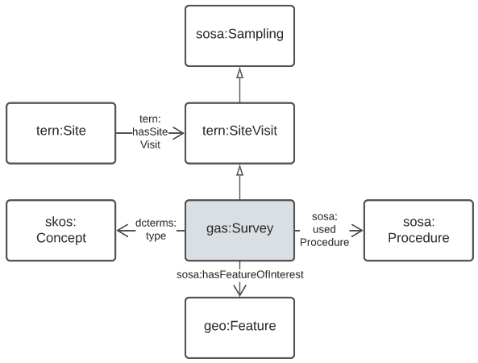

=== Data Domains Details

The Data Domains described above are implemented using multiple models and other resources. The following subsections describe the Domains' details and link to resources within them, such as Component Models.

==== Data Cataloguing Domain

===== Models

[cols="1,2,4"]
|===
| Model | Role | Notes

| Data Catalog Vocabulary <<DCAT>>
| Domain main model
| Supplies main modelling structures for this domain
|===

===== Examples

To do

==== Organisations & People Domain

===== Models

[cols="1,2,4"]
|===
| Model | Role | Notes

| The PROV Ontology <<PROV>> & schema.org <<SDO>>
| Domain main models
| Supplies main modelling structures for this domain. `prov:Agent` is the main class and `sdo:Person` & `sdo:Organization` are the two schema.org classes differentiating People & Organisations. PROV properties are used to link data to Agents; schema.org properties used to label Agents and relate them to one another
|===

===== Examples

To do

==== Sampling Domain

===== Models

[cols="1,2,4"]
|===
| Model | Role | Notes

| Semantic Sensor Network ontology <<SSN>>
| Domain main model
| Supplies main modelling structures for this domain

| TERN Ontology <<TERN>>
| Supporting Model
a| Based on the Semantic Sensor Network Ontology <<SSN>>, this model is used to characterise _sites_ and field sampling:

* supplies the `tern:Site` class which is the parent class of `gas:Mine`, `gas:FieldSite` etc.
* supplies `tern:SiteVisit` which is the parent class of `gas:Survey`

| https://surroundaustralia.github.io/ga-supermodel/ga-sampling.html[GA Sampling Profile]
| A <<component-data-model, Component Data Model>> defined for this Supermodel. 

Caters for detailed Material Sample properties; Specialised Sites modelling
a| A profile of several ontologies and a Semantic Web implementation of the Sampling Features Schema described in clauses 9-11 of <<ISO19156>>.

Directly inherits from:

* SOSA <<SOSA>> 
* _TERN Ontology_ <<TERN>>
* _SAM Lite ontology_ <<SAM>>

| https://surroundaustralia.github.io/ga-supermodel/sam-lite.html[SAM Lite ontology]
| Background Model
| A Semantic Web implementation of the Sampling Features Schema described in clauses 9-11 of <<ISO19156>> that was used for GA samples modelling 2015 - 2022. This ontology is no longer in direct use but is the foundation for the _GA Samples Ontology_

| https://github.com/Loop3D/GKM/[Loop3D GSO]

The https://loop3d.github.io/[Loop3D initiative]'s GeoScience Ontology
| Alignment target
| *Incomplete*

The Loop3D GSO is a detailed geology model and attempts are being made to align GA Samples data with it.
|===

===== Examples: Sample

Example representations of a Sample, http://pid.geoscience.gov.au/sample/AU128, according to one of the models listed above, is given below. 

Representations of AU128 according to all of the models listed above is delivered by the GA Samples API online at:

* http://pid.geoscience.gov.au/sample/AU128?_view=alternates[Alternative Profiles of AU128]

See also complete static data examples fpr AU128:

* https://github.com/surroundaustralia/ga-supermodel/blob/main/domain-models/examples/samples/[AU128 static examples]

Example data according to the <<GAS>>:

```turtle
@prefix role: <http://def.isotc211.org/.../CI_RoleCode/> .
@prefix sample: <http://pid.geoscience.gov.au/sample/> .
@prefix samples: <http://pid.geoscience.gov.au/samples> .

sample:AU128
    a tern:MaterialSample , geo:Feature ;
    rdfs:label "Sample igsn:AU128" ;
    dcterms:identifier "https://igsn.org/AU128"gas:IGSN ;
    sosa:isSampleOf <http://pid.geoscience.gov.au/site/17594> ;
    gas:samplingLocation [
        a geo:Geometry ;
        geo:asWKT "<http://www.opengis.net/def/crs/EPSG/0/4283> POINT(137.6250691792 -34.0411726571)"^^geo:wktLiteral ;
    ] ;    
    gas:currentLocation [
        a dct:Location ;
        dct:description "GA Services building" ;
    ] ;
    gas:samplingMethod <http://pid.geoscience.gov.au/def/voc/ga/igsncode/Rock> ;
    prov:hasQualifiedAttribution [
        prov:actor [
            a sdo:Person ;
            sdo:name "Raymond, O.L." ;
        ] ;
        prov:hadRole role:originator ;
    ] ,
    [
        prov:actor <http://linked.data.gov.au/org/ga> ;
        prov:hadRole role:custodian ;
    ] ;
.

samples: rdfs:member <http://pid.geoscience.gov.au/sample/> .
```

In the exmple data above, the sample AU128 is identified using the Persistent IRI `http://pid.geoscience.gov.au/sample/AU128` which is shortened to `sample:AU128` using a prefix.

It is declared to be of certain classes:

* `tern:MaterialSample` - a physical sample of something
* `geo:Feature` - a geospartial Feature

It has a basic label, "Sample igsn:AU128", and an alternate identifier, the https://www.igsn.org/[International GeoSample Number (IGSN)] "`+https://igsn.org/AU128+`".

It is a sample of Site 17594, a sampling location, a geometry, and a current location are given, as is a sampling method (clearly incorrect here!) and is indicated as being a member of a Feature Collection `+http://pid.geoscience.gov.au/sample/+` - the list of all GA's Samples.

Finally, two Agents are indicated as haveing roles in relation to this sample:

* a person "Raymond, O.L." - the sample's originator
** a more specialised role for this might be defined shortly
* `+<http://linked.data.gov.au/org/ga>+` (Geoscience Australia) - the sample's custodian

===== Examples: Survey

Surveys are modelled according to the GA Samples Profile, inheriting from the TERN Ontology, as per <<fig-surveys, Figure X>>

[id=fig-surveys]
.Survey modelling in the GA Samples Profile <<GAS>>


==== Spatiality Domain

===== Models

[cols="1,2,4"]
|===
| Model | Role | Notes

| GeoSPARQL 1.1 <<GEO>>
| Domain main model
| Supplies main modelling structures for this domain
|===

===== Examples

To do

==== Theming Domain

===== Models

[cols="1,2,4"]
|===
| Model | Role | Notes

| _Simple Knowledge Organization system (SKOS)_ ontology <<SKOS>>
| Domain main model
| Supplies main modelling structures for this domain
|===

===== Examples

To do